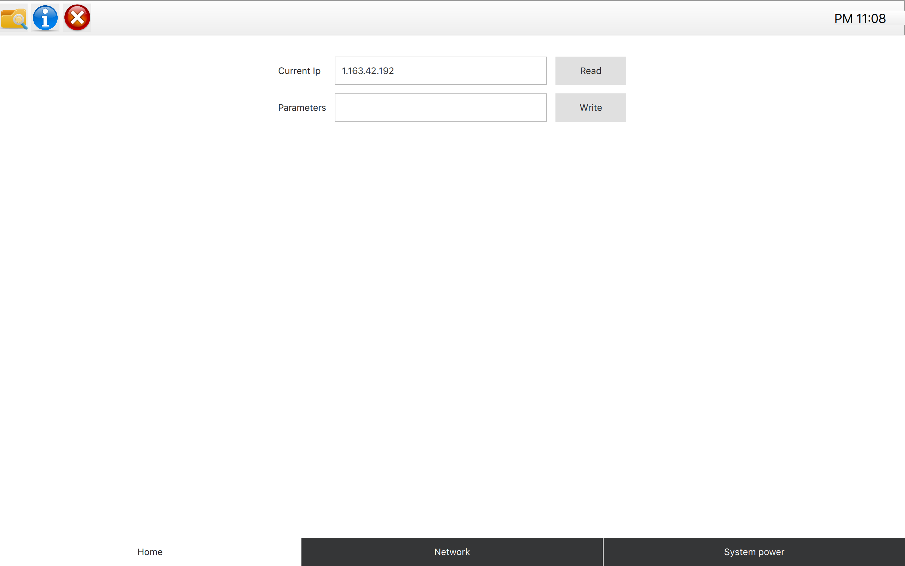

# Network Configuration Tool



## Require

- Qt5.10+
- CMake & Ninja

## Run in `Docker` (Optional)

Detail information please reference [qt-template](https://github.com/kaka-lin/qt-template/blob/master/docker/README.md)

- Run it on `Ubuntu`

    ```bash
    $ xhost +local:docker

    $ docker run --rm -it \
    -e DISPLAY=$DISPLAY \
    -e QT_X11_NO_MITSHM=1 \
    --volume="/tmp:/tmp" \
    --volume="/tmp/.X11-unix:/tmp/.X11-unix:rw" \
    --volume="$PWD:/home/user/network-configuration-tool" \
    --privileged \
    kakalin/qt:5.12.0
    ```

- Run it on `macOS`

    You need to install [XQuartz](https://www.xquartz.org/)

    ```bash
    $ open -a XQuartz

    $ xhost +localhost

    $ docker run --rm -it \
    -e DISPLAY=host.docker.internal:0\
    -e QT_X11_NO_MITSHM=1 \
    --volume="/tmp:/tmp" \
    --volume="/tmp/.X11-unix:/tmp/.X11-unix:rw" \
    --volume="$PWD:/home/user/network-configuration-tool" \
    --privileged \
    kakalin/qt:5.12.0

### Build and Run

Same as [Run in local machine](#run-in-local-machine)

## Run in local machine

### 1. Run with `qmake`

- build

    ```bash
    # only run this once
    $ chmod +x build.sh

    $ ./build.sh
    ```

- run

    ```bash
    $ ./network-config-tool

    # Qt 5.15.1
    $ ./network-config-tool.app/Contents/MacOS/network-config-tool
    ```

- clean

    ```bash
    # only run this once
    $ chmod +x clean.sh

    $ ./clean.sh
    ```

### 3. Run with `cmake`

- build

    ```bash
    # only run this once
    $ chmod +x cmake-build.sh

    $ ./cmake-build.sh
    ```

- run

    ```bash
    $ ./build/network-config-tool
    ```

- clean

    ```bash
    # only run this once
    $ chmod +x cmake-clean.sh

    $ ./cmake-clean.sh
    ```

## Trobuleshooting

### Qt is not found

Opening ```CMakeLists.txt``` and modify Qt location in ```list(APPEND CMAKE_PREFIX_PATH ${Your Qt path})```

### FullScreen

```bash
QT_WAYLAND_SHELL_INTEGRATION=wl-shell ./network-config-tool.pro
```
